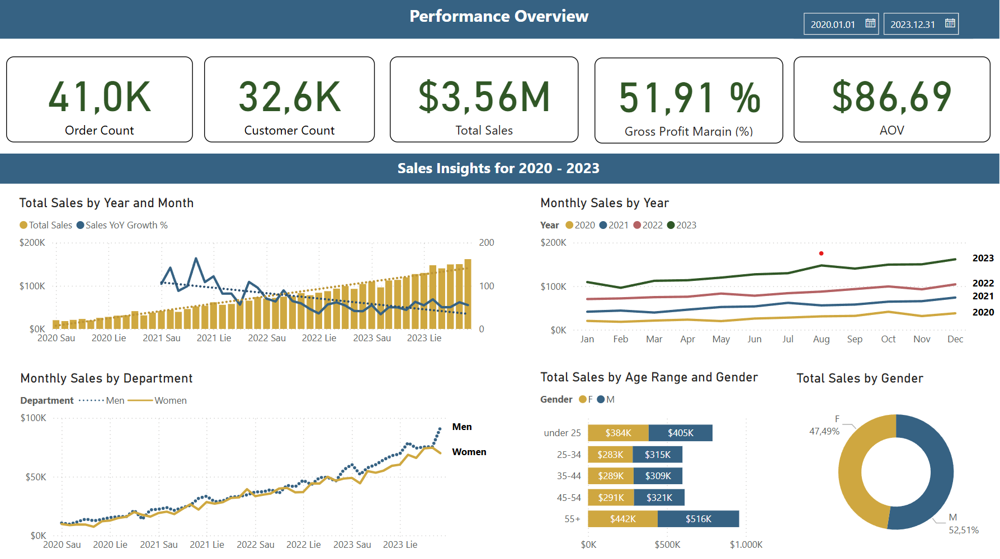
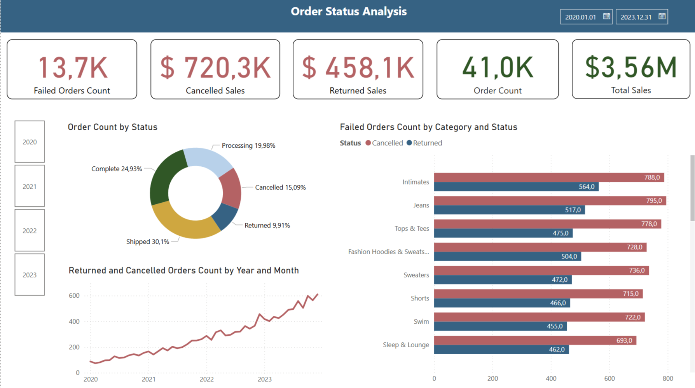
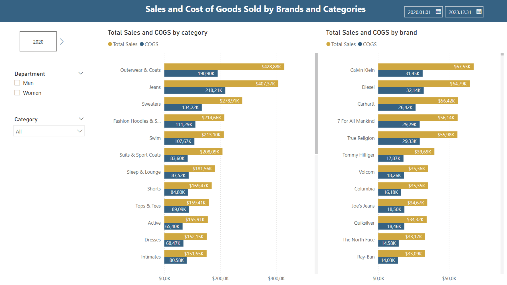
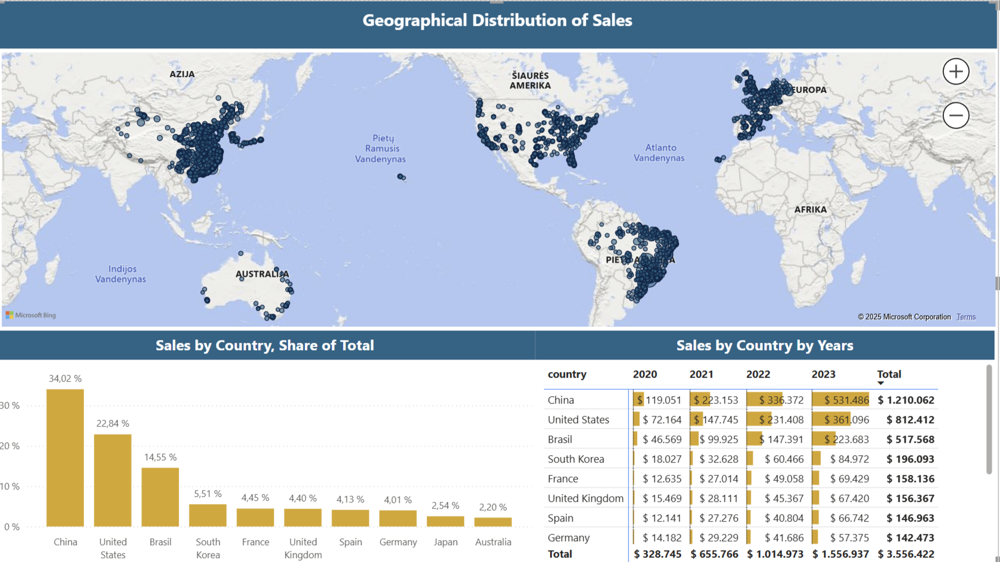
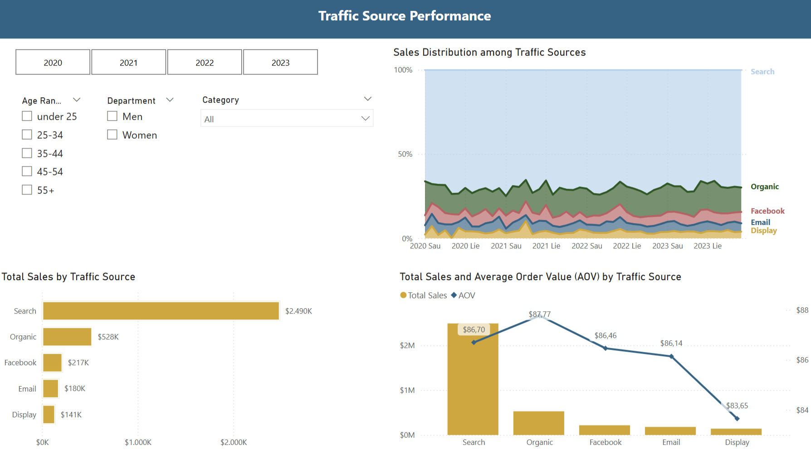

# 🛍️ E-commerce Sales & Customer Insights Dashboard (Power BI + BigQuery)

## 🧠 Project Summary

This Power BI dashboard provides an in-depth analysis of the `thelook_ecommerce` dataset from Google BigQuery. It explores customer behavior, sales trends, and product performance to help stakeholders make informed business decisions.

---

## 🎯 Objective

- Analyze sales revenue, profit, and order trends
- Identify top-performing products, categories, and brands
- Understand customer segments by age, gender, and location
- Provide actionable insights for marketing and inventory planning
- Gather feedback from stakeholders on the desired data insights and encourage them to formulate specific questions.

---

## 🛠️ Tools Used

- **Google BigQuery** – SQL queries for extracting and transforming data  
- **Power BI Desktop** – Data modeling, visualization, dashboard creation  
- **DAX** – Measures for KPIs like profit margin, average order value

---

## 📂 Dataset Overview

Data Source: [`thelook_ecommerce`](https://console.cloud.google.com/bigquery?project=bigquery-public-data&p=bigquery-public-data&d=thelook_ecommerce&page=dataset)

| Table | Description |
|-------|-------------|
| orders | Order-level data, status |
| order_items | Order data per item |
| users | Customer demographics, traffic source |
| products | Product name, brand, category, department, cost and retail price |
| inventory_items | Inventory and cost details |
| events | Web session events

---

## 📈 Key Visuals & Insights

### Highlights:

- **Revenue over time:** Revenue shows consistent year-over-year growth across three years, but the **growth rate is slowing** - a common trend following an initial steep launch phase.
- **Profitability:** Company maintains good profitability with overall sales margin of **51.91%**.
- **Customer demographics:** Most purchases come from the **55+** age group, followed by customers **under 25**. There are slightly more male buyers than female.
- ❗🚨 **Critical Insight:** **Cancelled orders** account for ~15% of all orders - this represents a **significant revenue loss**. It's essential to investigate the causes and take action.  
- **Returned orders** make up ~10% of all orders - a **normal trend in fashion e-commerce**, as customers can't try items before buying.
- **Geographical trends:** China and United States lead in customer orders and sales volumes
- **Traffic sources performance:** Search is the **top revenue driver**, significantly outperforming other channels with **$2.490K** in total sales.

---

## 📁 Files Included

- `thelook_ecommerce_dashboard.pbix` – Power BI dashboard file
- `bq_sql_queries.sql` – All SQL queries used to extract data
- `/images/` – Screenshots of visuals used in README

---

## 📬 Contact

**Your Name**  
Digital Marketing & Analytics Student  
📧 dainudainuze@gmail.com  
🔗 [LinkedIn](https://www.linkedin.com/in/daina-siauciulyte-38a14269/) | [GitHub](https://github.com/Dainuze)

> ⭐ _This project was completed as part of my digital marketing studies and showcases my ability to connect raw data to real-world business decisions._

